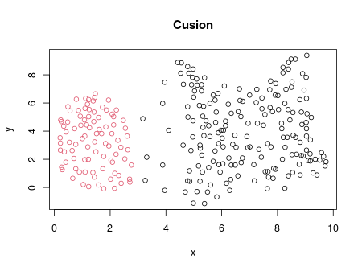
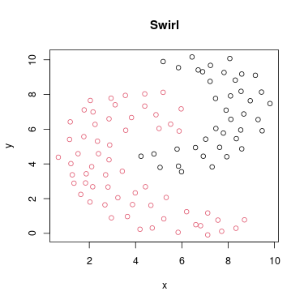

# Simple 2D example datasets for clustering

Digitised examples from this [towardsdatascience post](https://towardsdatascience.com/understanding-the-concept-of-hierarchical-clustering-technique-c6e8243758ec).

## Datasets
  
  
  
